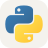
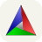

<h1 align="center">Nabil Bachroin</h1>

  <picture>
    <source media="(max-width: 600px) and (prefers-color-scheme: dark)" srcset="https://readme-typing-svg.demolab.com?font=Fira+Code&amp;weight=500&amp;size=20&amp;duration=3200&amp;pause=1300&amp;color=45D7EE&amp;center=true&amp;vCenter=true&amp;width=360&amp;height=55&amp;repeat=true&amp;letterSpacing=0&amp;lines=Embedded+Firmware+Engineer%3BWireless+Audio+%26+USB+HID%3BOpus+Codec+%26+DSP%3BC%2C+Python+%26+TypeScript" />
    <source media="(max-width: 600px)" srcset="https://readme-typing-svg.demolab.com?font=Fira+Code&amp;weight=500&amp;size=20&amp;duration=3200&amp;pause=1300&amp;color=087E98&amp;center=true&amp;vCenter=true&amp;width=360&amp;height=55&amp;repeat=true&amp;letterSpacing=0&amp;lines=Embedded+Firmware+Engineer%3BWireless+Audio+%26+USB+HID%3BOpus+Codec+%26+DSP%3BC%2C+Python+%26+TypeScript" />
    <source media="(prefers-color-scheme: dark)" srcset="https://readme-typing-svg.demolab.com?font=Fira+Code&amp;weight=500&amp;size=20&amp;duration=3200&amp;pause=1300&amp;color=45D7EE&amp;center=true&amp;vCenter=true&amp;width=600&amp;height=55&amp;repeat=true&amp;letterSpacing=0&amp;lines=Embedded+Firmware+Engineer%3BLow-Latency+Wireless+Audio+%26+HID%3BOpus+Codec+%26+DSP+Optimization%3BBare-metal+C+by+day%2C+TypeScript+by+night" />
    
  </picture>

Wireless audio · Bluetooth LE · USB HID · DSP

Taipei, Taiwan · Banyuwangi, Indonesia

  
  
  
  

I build firmware for connected devices, with a focus on wireless input, audio codecs, and DSP optimization.
Outside embedded systems, I build web applications and automation for everyday needs, with a research background in computer vision and 3D reconstruction.

<a href="#engineering-portfolio-console">Portfolio</a> · <a href="#tech-stack">Stack</a> · <a href="#selected-work">Work</a> · <a href="#featured-embedded-system">Featured System</a> · <a href="#activity">Activity</a>

## Engineering Portfolio Console

<!-- DEMO:START -->

  <picture>
    <source media="(max-width: 600px) and (prefers-color-scheme: dark)" srcset="./metrics/mini-demo-mobile-dark.svg?v=7bdad29716fd" />
    <source media="(max-width: 600px)" srcset="./metrics/mini-demo-mobile.svg?v=3f31d9ee136f" />
    <source media="(prefers-color-scheme: dark)" srcset="./metrics/mini-demo-dark.svg?v=19c1637f8afe" />
    
  </picture>

<!-- DEMO:END -->

## Tech Stack

**Embedded, RTOS & Protocols**

  
  
  
  
  
  
  

**Languages**

  <picture><source media="(prefers-color-scheme: dark)" srcset="./assets/icons/c-dark.svg" /></picture>
  <picture><source media="(prefers-color-scheme: dark)" srcset="./assets/icons/cpp-dark.svg" /></picture>
  <picture><source media="(prefers-color-scheme: dark)" srcset="./assets/icons/python-dark.svg" /></picture>
  <picture><source media="(prefers-color-scheme: dark)" srcset="./assets/icons/ts-dark.svg" /></picture>
  <picture><source media="(prefers-color-scheme: dark)" srcset="./assets/icons/js-dark.svg" /></picture>
  <picture><source media="(prefers-color-scheme: dark)" srcset="./assets/icons/php-dark.svg" /></picture>

**Frameworks & Runtimes**

  <picture><source media="(prefers-color-scheme: dark)" srcset="./assets/icons/nodejs-dark.svg" /></picture>
  <picture><source media="(prefers-color-scheme: dark)" srcset="./assets/icons/express-dark.svg" /></picture>
  <picture><source media="(prefers-color-scheme: dark)" srcset="./assets/icons/fastapi-dark.svg" /></picture>
  <picture><source media="(prefers-color-scheme: dark)" srcset="./assets/icons/laravel-dark.svg" /></picture>
  <picture><source media="(prefers-color-scheme: dark)" srcset="./assets/icons/react-dark.svg" /></picture>
  <picture><source media="(prefers-color-scheme: dark)" srcset="./assets/icons/vue-dark.svg" /></picture>
  <picture><source media="(prefers-color-scheme: dark)" srcset="./assets/icons/nuxtjs-dark.svg" /></picture>
  <picture><source media="(prefers-color-scheme: dark)" srcset="./assets/icons/vite-dark.svg" /></picture>

**Database & ORM**

  <picture><source media="(prefers-color-scheme: dark)" srcset="./assets/icons/postgres-dark.svg" /></picture>
  <picture><source media="(prefers-color-scheme: dark)" srcset="./assets/icons/prisma-dark.svg" /></picture>

**Tools**

  <picture><source media="(prefers-color-scheme: dark)" srcset="./assets/icons/git-dark.svg" /></picture>
  <picture><source media="(prefers-color-scheme: dark)" srcset="./assets/icons/github-dark.svg" /></picture>
  <picture><source media="(prefers-color-scheme: dark)" srcset="./assets/icons/gitlab-dark.svg" /></picture>
  <picture><source media="(prefers-color-scheme: dark)" srcset="./assets/icons/vscode-dark.svg" /></picture>
  <picture><source media="(prefers-color-scheme: dark)" srcset="./assets/icons/docker-dark.svg" /></picture>
  <picture><source media="(prefers-color-scheme: dark)" srcset="./assets/icons/postman-dark.svg" /></picture>
  <picture><source media="(prefers-color-scheme: dark)" srcset="./assets/icons/linux-dark.svg" /></picture>
  <picture><source media="(prefers-color-scheme: dark)" srcset="./assets/icons/bash-dark.svg" /></picture>
  <picture><source media="(prefers-color-scheme: dark)" srcset="./assets/icons/cmake-dark.svg" /></picture>

## Selected Work

Professional work is described by technology. Personal projects and family websites remain unlinked.

<!-- PROJECTS:START -->

  <picture>
    <source media="(max-width: 600px) and (prefers-color-scheme: dark)" srcset="./metrics/projects-emb-mobile-dark.svg?v=0e8ca7064d4d" />
    <source media="(max-width: 600px)" srcset="./metrics/projects-emb-mobile.svg?v=2e51efb79419" />
    <source media="(prefers-color-scheme: dark)" srcset="./metrics/projects-emb-dark.svg?v=775aa8a71eeb" />
    
  </picture>

  <picture>
    <source media="(max-width: 600px) and (prefers-color-scheme: dark)" srcset="./metrics/projects-web-mobile-dark.svg?v=e419bbb4870a" />
    <source media="(max-width: 600px)" srcset="./metrics/projects-web-mobile.svg?v=0f7075364291" />
    <source media="(prefers-color-scheme: dark)" srcset="./metrics/projects-web-dark.svg?v=d4e9889889b0" />
    
  </picture>

  <picture>
    <source media="(max-width: 600px) and (prefers-color-scheme: dark)" srcset="./metrics/projects-ml-mobile-dark.svg?v=6646e4205883" />
    <source media="(max-width: 600px)" srcset="./metrics/projects-ml-mobile.svg?v=049357340332" />
    <source media="(prefers-color-scheme: dark)" srcset="./metrics/projects-ml-dark.svg?v=66322101be34" />
    
  </picture>

Repository commits include all authors on the default branch. Grouped projects sum their repository histories; counts are not a measure of individual output.

[Read the text version of selected work](./PROJECTS.md).
<!-- PROJECTS:END -->

## Featured Embedded System

<!-- SIGNAL:START -->

  <picture>
    <source media="(max-width: 600px) and (prefers-color-scheme: dark)" srcset="./metrics/signal-flow-mobile-dark.svg?v=a253fc723166" />
    <source media="(max-width: 600px)" srcset="./metrics/signal-flow-mobile.svg?v=97c304869728" />
    <source media="(prefers-color-scheme: dark)" srcset="./metrics/signal-flow-dark.svg?v=b9f1429e9459" />
    
  </picture>

<!-- SIGNAL:END -->

## Activity

<!-- LANGUAGES:START -->

  <picture>
    <source media="(max-width: 600px) and (prefers-color-scheme: dark)" srcset="./metrics/languages-mobile-dark.svg?v=6aa69bbd3b1e" />
    <source media="(max-width: 600px)" srcset="./metrics/languages-mobile.svg?v=be4f901b4bf2" />
    <source media="(prefers-color-scheme: dark)" srcset="./metrics/languages-dark.svg?v=b454e8dab01a" />
    
  </picture>

<!-- LANGUAGES:END -->

  <picture>
    <source media="(prefers-color-scheme: dark)" srcset="https://raw.githubusercontent.com/nabilbachroin/nabilbachroin/output/snake-dark.svg" />
    
  </picture>

Project metrics refresh automatically. Skill icons by <a href="https://github.com/tandpfun/skill-icons">Skill Icons</a>.

Contribution Activity Console

<!-- OVERVIEW:START -->

  <picture>
    <source media="(max-width: 600px) and (prefers-color-scheme: dark)" srcset="./metrics/overview-mobile-dark.svg?v=c5a8dc8c83f4" />
    <source media="(max-width: 600px)" srcset="./metrics/overview-mobile.svg?v=a79f4da60290" />
    <source media="(prefers-color-scheme: dark)" srcset="./metrics/overview-dark.svg?v=903699d4b600" />
    
  </picture>

<!-- OVERVIEW:END -->

