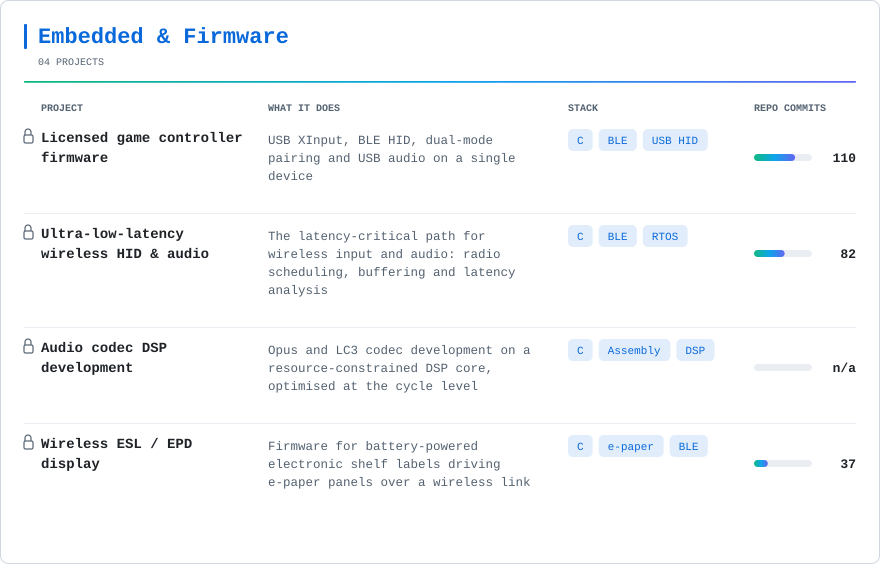
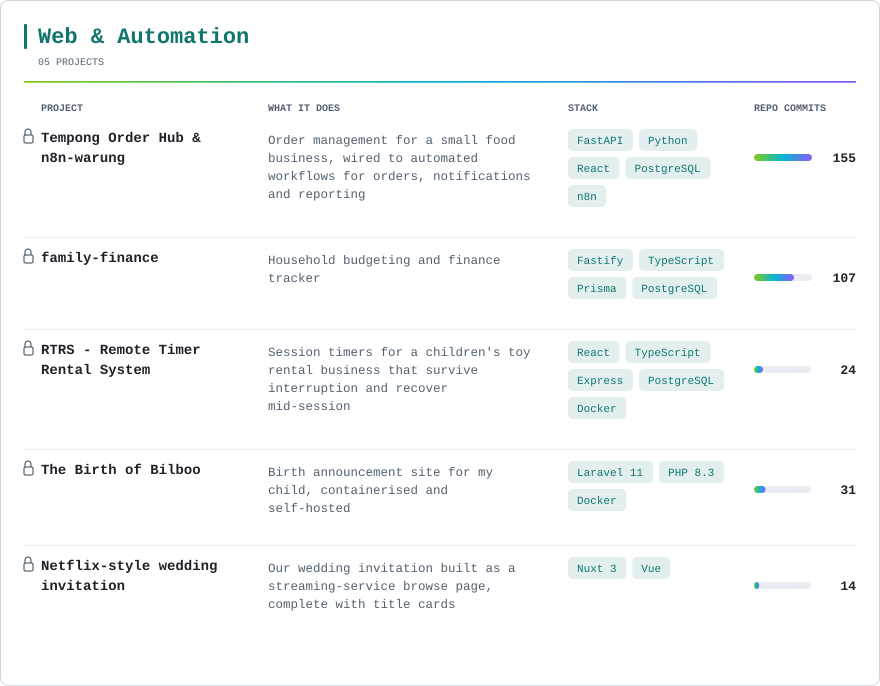
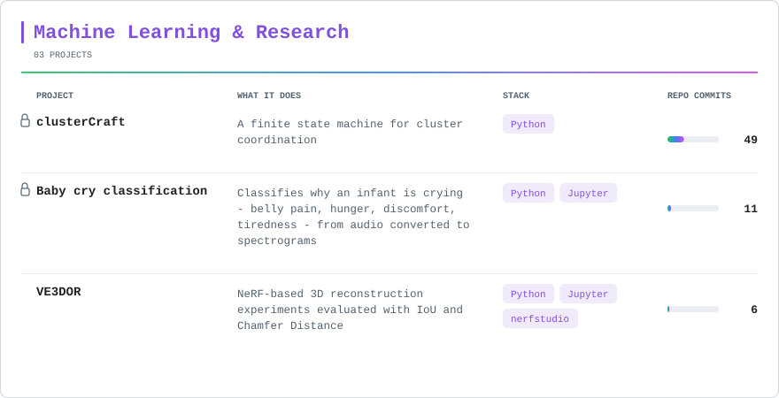

<h1 align="center">Nabil Bachroin</h1>

  

  
  

---

### 🔌 About

- Embedded firmware engineer working on **Bluetooth audio & HID system-on-chips**
- Day-to-day: **BLE stacks, USB HID / XInput, Opus codec & DSP optimization**, low-latency wireless audio
- Research background in **computer vision** — NeRF, volumetric rendering, 3D reconstruction
- Based in **Taipei, Taiwan** 🇹🇼 · originally from **Banyuwangi, Indonesia** 🇮🇩
- Off-hours: full-stack side projects in **TypeScript / Python / Vue** and workflow automation with **n8n**

> Most of my professional work lives in private repositories under NDA.
> The metrics below **include private contributions in aggregate** — no client names, repository names, or commit messages are exposed.

### 🌐 Connect

  <!-- GitLab deliberately not linked: the account lives on an internal office
       host at a private RFC 1918 address, so the link is unreachable from
       outside and would only publish internal network detail. The GitLab icon
       in Tools already covers the experience. -->
  
  
  
  

### 🧰 Tech Stack

**Programming Languages & Frameworks**

  <picture>
    <source media="(prefers-color-scheme: dark)" srcset="https://skillicons.dev/icons?i=c%2Ccpp%2Cpython%2Cts%2Cjs%2Cphp%2Cnodejs%2Cexpress%2Cfastapi%2Claravel%2Creact%2Cvue%2Cnuxtjs%2Cvite&theme=dark&perline=14" />
    <source media="(prefers-color-scheme: light)" srcset="https://skillicons.dev/icons?i=c%2Ccpp%2Cpython%2Cts%2Cjs%2Cphp%2Cnodejs%2Cexpress%2Cfastapi%2Claravel%2Creact%2Cvue%2Cnuxtjs%2Cvite&theme=light&perline=14" />
    
  </picture>

**Database & ORM**

  <picture>
    <source media="(prefers-color-scheme: dark)" srcset="https://skillicons.dev/icons?i=postgres%2Cprisma&theme=dark" />
    <source media="(prefers-color-scheme: light)" srcset="https://skillicons.dev/icons?i=postgres%2Cprisma&theme=light" />
    
  </picture>

**Tools**

  <picture>
    <source media="(prefers-color-scheme: dark)" srcset="https://skillicons.dev/icons?i=git%2Cgithub%2Cgitlab%2Cvscode%2Cdocker%2Cpostman%2Clinux%2Cbash%2Ccmake&theme=dark&perline=9" />
    <source media="(prefers-color-scheme: light)" srcset="https://skillicons.dev/icons?i=git%2Cgithub%2Cgitlab%2Cvscode%2Cdocker%2Cpostman%2Clinux%2Cbash%2Ccmake&theme=light&perline=9" />
    
  </picture>

<!-- The commas in `i=` MUST stay percent-encoded as %2C. `srcset` treats a bare
     comma as the separator between image candidates, so a literal comma makes
     the browser request only `?i=c` and render a single enlarged icon. -->

**Embedded, RTOS & Protocols**

<!-- Every badge carries an icon. Bluetooth uses its own simple-icons
     logo; Keil MDK uses the Arm logo because Keil MDK is an Arm product,
     and Zephyr the Linux Foundation logo because Zephyr is an LF project.
     FreeRTOS, USB, Opus/LC3 and DSP have no simple-icons entry at all, so
     those four pass a hand-drawn glyph through shields.io's
     `logo=data:image/svg+xml;base64,...` parameter - which is why those
     URLs are long. The glyphs are symbolic, not official marks, except the
     USB trident which is the real USB symbol.
     Colours group the row by category: teal for RTOS, amber for the
     toolchain, blue for wire protocols, purple for codec and DSP work. -->

### 🚀 Selected Work

🔒 marks a private repository — client work under NDA, or a personal project I
have not opened up. Nothing here is linked: the firmware work is under NDA, and
the personal sites are unlisted by design. Firmware entries are described by the
technology rather than the platform holder.

  <picture>
    <source media="(prefers-color-scheme: dark)" srcset="./metrics/projects-emb-dark.svg" />
    <source media="(prefers-color-scheme: light)" srcset="./metrics/projects-emb.svg" />
    
  </picture>

  <picture>
    <source media="(prefers-color-scheme: dark)" srcset="./metrics/projects-web-dark.svg" />
    <source media="(prefers-color-scheme: light)" srcset="./metrics/projects-web.svg" />
    
  </picture>

  <picture>
    <source media="(prefers-color-scheme: dark)" srcset="./metrics/projects-ml-dark.svg" />
    <source media="(prefers-color-scheme: light)" srcset="./metrics/projects-ml.svg" />
    
  </picture>

Same content as selectable text &#8212; the cards above are images, so this table is here for screen readers, search and copy-paste

 

<b>🔌 Embedded &amp; Firmware</b>

 

| Project | What it does | Stack |
|---|---|---|
| **Licensed game controller firmware** 🔒 | Production firmware for wireless game controllers: USB XInput, BLE HID, dual-mode pairing, and USB audio on the same device | C · BLE · USB HID |
| **Ultra-low-latency wireless HID & audio** 🔒 | The latency-critical path for wireless input and audio — radio scheduling and buffering tuned until the lag stops being perceptible | C · BLE · RTOS |
| **Audio codec DSP development** 🔒 | Opus and LC3 codec development on a resource-constrained DSP core, optimised at the cycle level | C · Assembly · DSP |
| **Wireless ESL / EPD display** 🔒 | Firmware for battery-powered electronic shelf labels driving e-paper panels over a wireless link | C · e-paper · BLE |

<b>🌐 Web &amp; Automation</b>

 

| Project | What it does | Stack |
|---|---|---|
| **The Birth of Bilboo** 🔒 | Birth announcement site for my child, containerised and self-hosted | Laravel 11 · PHP 8.3 · Docker |
| **Netflix-style wedding invitation** 🔒 | Our wedding invitation built as a streaming-service browse page, complete with title cards | Nuxt 3 · Vue |
| **RTRS — Remote Timer Rental System** 🔒 | Rental management for a children's toy rental business: session timers that survive interruption and recover mid-session | React · TypeScript · Express · PostgreSQL · Docker |
| **Tempong Order Hub & n8n-warung** 🔒 | Order management for a small food business, wired to automated workflows for orders, notifications and reporting | FastAPI · Python · React · PostgreSQL · n8n |
| **family-finance** 🔒 | Household budgeting and finance tracker | Fastify · TypeScript · Prisma · PostgreSQL |

<b>🧠 Machine Learning &amp; Research</b>

 

| Project | What it does | Stack |
|---|---|---|
| **VE3DOR** | 3D object reconstruction taking NeRF as the baseline and extending it, with reconstruction quality scored by IoU and Chamfer Distance | Python · Jupyter · nerfstudio |
| **Baby cry classification** 🔒 | Classifies *why* an infant is crying — belly pain, hunger, discomfort, tiredness — from audio converted to spectrograms | Python · Jupyter |
| **clusterCraft** 🔒 | A finite state machine for cluster coordination | Python |

### 📊 GitHub Metrics

  

  <picture>
    <source media="(prefers-color-scheme: dark)" srcset="./metrics/languages-dark.svg" />
    <source media="(prefers-color-scheme: light)" srcset="./metrics/languages.svg" />
    
  </picture>

  <picture>
    <source media="(prefers-color-scheme: dark)" srcset="https://streak-stats.demolab.com?user=nabilbachroin&theme=react&hide_border=true&date_format=j%20M%5B%20Y%5D" />
    <source media="(prefers-color-scheme: light)" srcset="https://streak-stats.demolab.com?user=nabilbachroin&theme=default&hide_border=true&date_format=j%20M%5B%20Y%5D" />
    
  </picture>

### 🐍 Contribution Graph

  <picture>
    <source media="(prefers-color-scheme: dark)" srcset="https://raw.githubusercontent.com/nabilbachroin/nabilbachroin/output/snake-dark.svg" />
    <source media="(prefers-color-scheme: light)" srcset="https://raw.githubusercontent.com/nabilbachroin/nabilbachroin/output/snake.svg" />
    
  </picture>

